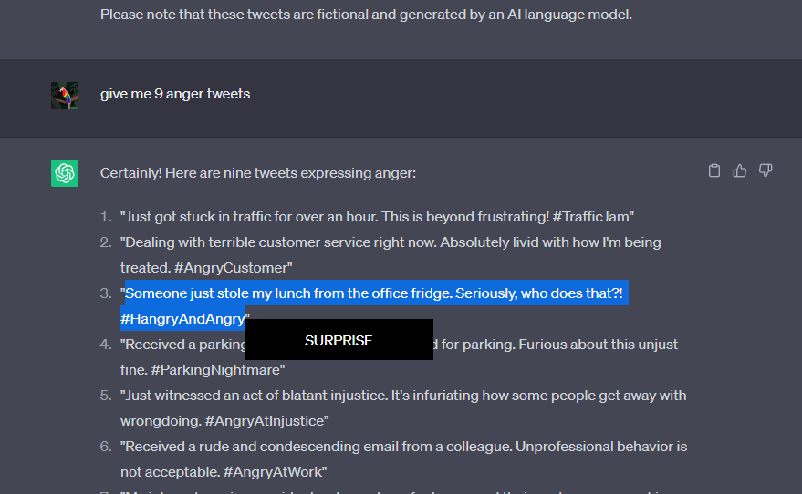

# Transformer-Text-Classification

Mainly, this project shows how to build a text classification using pretrained model, which is DistilBERT, and finetuning it using desirable data to output desirable output as well.

Dataset:

-   [Emotion Dataset for Emotion Recognition Tasks (Kaggle)](https://www.kaggle.com/datasets/parulpandey/emotion-dataset?select=training.csv)
-   [Emotion Detection from Text (Kaggle)](https://www.kaggle.com/datasets/pashupatigupta/emotion-detection-from-text)
     

Pretrained Model:

-   DistilBERT
     

Finetuned Model:

-   [mclass_model_distilbert](https://drive.google.com/drive/folders/1V67W1pTgLd8BSxT3JE0p0Vlgo50zyaZ0?usp=share_link)
     

But, as a product of this project, I have build a chrome extension. Below are steps how to run the program (product):

-   go to 'chrome-extension'
-   you will find main.py, which is the server (using flask), and run it (but don't forget to activate the conda environment which all necessary packages can be found inside a yml file)
-   to make the chrome-extension to appear, you need to go to 'extension' menu in chrome setting, and activate the developer mode
-   once activated, you will notice on top left, there will be a menu asking you to upload unpacked chrome-extension
-   upload the 'chrome-extension', and turn it on
-   once the extension is on, try to select any text on any website (don't forget to refresh the page if it's already opened before the extension)
-   then, once the mouseup, there will be a popup appears right under your cursor that tells the emotion of the selected text

